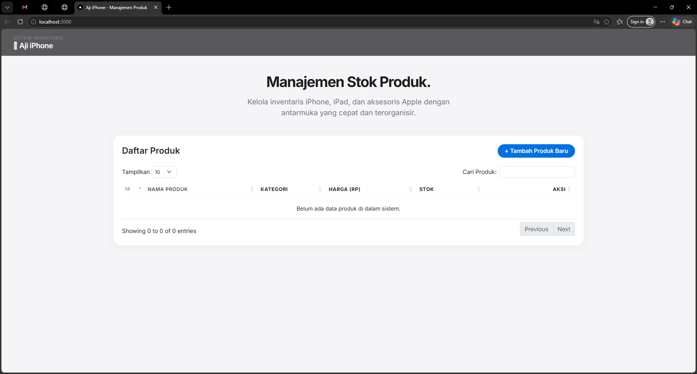
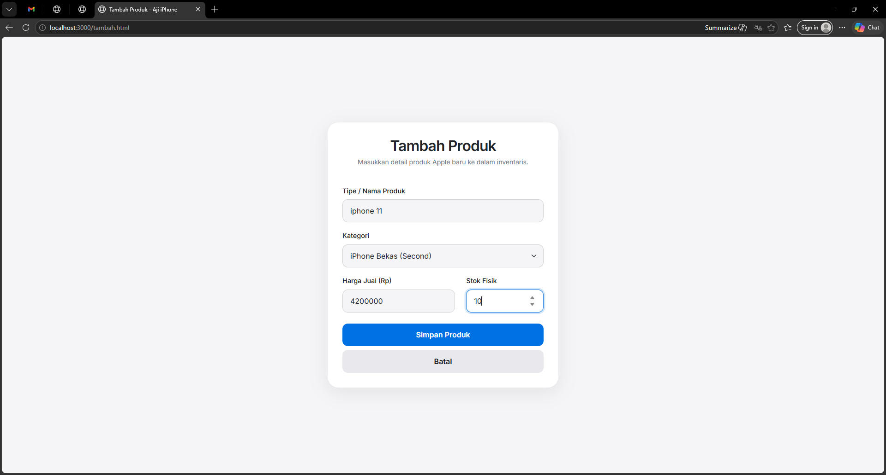
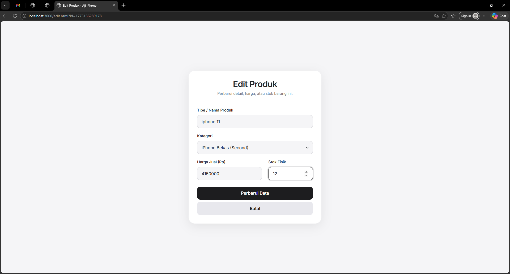
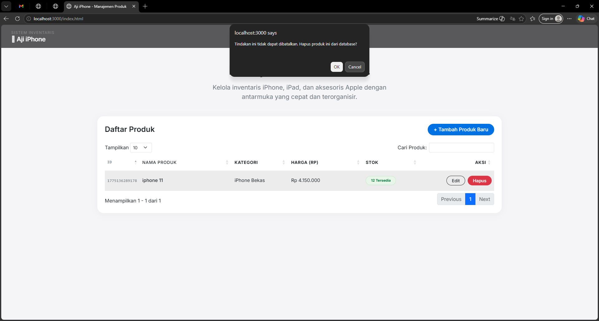

<div align="center">
  <br />

  <h1>LAPORAN PRAKTIKUM <br>
  APLIKASI BERBASIS PLATFORM
  </h1>

  <br />

  <h3>TUGAS COTS-1<br>
  Arvan Hiking - Sistem Manajemen Peralatan Outdoor
  </h3>

  <br />

  

  <br />
  <br />
  <br />

  <h3>Disusun Oleh :</h3>

  <p>
    <strong>Aji Tri Prasetyo</strong><br>
    <strong>2311102064</strong><br>
    <strong>S1 IF-11-04</strong>
  </p>

  <br />

  <h3>Dosen Pengampu :</h3>

  <p>
    <strong>Cahyo Prihantoro, S.Kom., M.Eng.</strong>
  </p>
  
  <br />
  <br />
    <h4>Asisten Praktikum :</h4>
    <strong>Apri Pandu Wicaksono </strong> <br>
    <strong>Rangga Pradarrell Fathi</strong>
  <br />

  <h3>LABORATORIUM HIGH PERFORMANCE
 <br>FAKULTAS INFORMATIKA <br>UNIVERSITAS TELKOM PURWOKERTO <br>2026</h3>
</div>

<hr>

## 📖 Deskripsi Aplikasi

Aplikasi **Aji iPhone** merupakan sistem informasi berbasis web untuk mengelola stok inventaris produk Apple seperti iPhone, iPad, dan aksesoris lainnya. Aplikasi ini sudah menerapkan konsep CRUD (Create, Read, Update, Delete) menggunakan Node.js dan Express.js di sisi backend.

Frontend dibangun menggunakan HTML, Bootstrap dengan kustomisasi antarmuka bergaya Apple (Glassmorphism), dan jQuery, sedangkan backend menggunakan Node.js dengan framework Express.js. Data disimpan sementara dalam memori server (_in-memory storage_) dan dikirim dalam format JSON.

---

## 1. Dasar Teori

**CRUD (Create, Read, Update, Delete)** merupakan konsep dasar dalam pengelolaan data pada aplikasi. CRUD memungkinkan pengguna untuk menambah, melihat, mengubah, dan menghapus data secara dinamis.

**Node.js** adalah runtime JavaScript berbasis server yang menggunakan arsitektur event-driven dan non-blocking I/O sehingga efisien dalam menangani banyak request.

**Express.js** merupakan framework backend yang digunakan untuk membangun REST API dan mengelola routing HTTP.

**Bootstrap** adalah framework CSS untuk membuat tampilan web responsif dengan komponen siap pakai.

**jQuery** digunakan untuk mempermudah manipulasi DOM dan komunikasi AJAX.

**DataTables** adalah plugin jQuery yang digunakan untuk membuat tabel interaktif dengan fitur search, sorting, dan pagination.

**JSON** digunakan sebagai format pertukaran data antara client dan server.
---

## 2. Deskripsi Aplikasi

Aplikasi **Aji iPhone** merupakan sistem manajemen data produk berbasis web yang dibangun menggunakan Node.js dan Express.

Fitur utama:

- Menampilkan daftar produk (iPhone Baru, iPhone Bekas, iPad, Aksesoris, dll.)
- Menambahkan data produk baru
- Mengedit data produk
- Menghapus data produk
- Tabel interaktif dengan DataTables
- Data berbasis JSON (tanpa database)

---

## 3. Struktur Folder Project

```bash
tugas-cots-2311102064/
├── server.js
├── package.json
├── public/
│   ├── index.html
│   ├── tambah.html
│   ├── edit.html
│   ├── script.js
│
└── assets/
    ├── beranda.png
    ├── edit_part.png
    ├── tambah_part.png
    ├── hapus_part.png
```

### Penjelasan

| File      | Keterangan         |
| --------- | ------------------ |
| server.js | Backend Express    |
| public/   | File frontend      |
| assets/   | Gambar dokumentasi |

---

## 4. Cara Menjalankan Aplikasi

```bash
npm install
node server.js
```

Akses:

```
http://localhost:3000
```

---

## 5. Kode Program

### A. server.js

```
const express = require("express");
const path = require("path");
const app = express();
const port = 3000;

app.use(express.json({ limit: "10kb" }));
app.use(express.urlencoded({ extended: true, limit: "10kb" }));

app.use(express.static(path.join(__dirname, "public")));

let products = [];

app.get("/api/products", (req, res) => {
  res.status(200).json({ data: products });
});

app.post("/api/products", (req, res) => {
  const { nama, kategori, harga, stok } = req.body;

  // Validasi ketat mencegah injeksi data kosong
  if (!nama || !kategori || !harga || !stok) {
    return res.status(400).json({ error: "Data produk tidak boleh kosong!" });
  }

  const newProduct = {
    id: Date.now(),
    nama,
    kategori,
    harga: parseInt(harga),
    stok: parseInt(stok),
  };

  products.push(newProduct);
  res.status(201).json({ message: "Produk berhasil ditambahkan!" });
});

app.get("/api/products/:id", (req, res) => {
  const product = products.find((p) => p.id === parseInt(req.params.id));
  if (!product)
    return res.status(404).json({ error: "Produk tidak ditemukan" });
  res.status(200).json(product);
});

app.put("/api/products/:id", (req, res) => {
  const { nama, kategori, harga, stok } = req.body;
  const index = products.findIndex((p) => p.id === parseInt(req.params.id));

  if (index === -1) {
    return res.status(404).json({ error: "Produk tidak ditemukan" });
  }

  products[index] = { ...products[index], nama, kategori, harga, stok };
  res.status(200).json({ message: "Produk berhasil diperbarui!" });
});

app.delete("/api/products/:id", (req, res) => {
  products = products.filter((p) => p.id !== parseInt(req.params.id));
  res.status(200).json({ message: "Produk berhasil dihapus!" });
});

app.listen(port, () => {
  console.log(
    `[SECURITY-OK] Server Aji iPhone berjalan di http://localhost:${port}`,
  );
});


```

### B. Index.html

```
<!doctype html>
<html lang="id">
  <head>
    <meta charset="UTF-8" />
    <meta name="viewport" content="width=device-width, initial-scale=1.0" />
    <title>Aji iPhone - Manajemen Produk</title>

    <link rel="preconnect" href="https://fonts.googleapis.com" />
    <link rel="preconnect" href="https://fonts.gstatic.com" crossorigin />
    <link
      href="https://fonts.googleapis.com/css2?family=Inter:wght@300;400;500;600;700&display=swap"
      rel="stylesheet"
    />

    <link
      href="https://cdn.jsdelivr.net/npm/bootstrap@5.3.0/dist/css/bootstrap.min.css"
      rel="stylesheet"
    />
    <link
      href="https://cdn.datatables.net/1.13.6/css/dataTables.bootstrap5.min.css"
      rel="stylesheet"
    />

    <style>
      body {
        font-family: "Inter", sans-serif;
        background-color: #f5f5f7; /* Warna latar khas Apple */
        color: #1d1d1f;
      }
      /* Glassmorphism Navbar */
      .top-bar {
        background-color: rgba(29, 29, 31, 0.72);
        backdrop-filter: saturate(180%) blur(20px);
        -webkit-backdrop-filter: saturate(180%) blur(20px);
        position: sticky;
        top: 0;
        z-index: 1000;
        padding: 1rem 2rem;
        display: flex;
        justify-content: space-between;
        align-items: center;
        box-shadow: 0 1px 0 rgba(255, 255, 255, 0.1);
      }
      .top-bar .brand h3 {
        font-size: 1.25rem;
        font-weight: 600;
        margin: 0;
        letter-spacing: -0.02em;
        color: #f5f5f7;
      }
      .top-bar .brand p {
        font-size: 0.75rem;
        margin: 0;
        color: #86868b;
        text-transform: uppercase;
        letter-spacing: 0.1em;
      }
      /* Custom Cards */
      .card-custom {
        border-radius: 20px;
        border: none;
        box-shadow: 0 4px 24px rgba(0, 0, 0, 0.04);
        background: #ffffff;
        overflow: hidden;
      }
      /* Custom Buttons */
      .btn-apple-primary {
        background-color: #0071e3;
        color: white;
        border-radius: 20px;
        padding: 0.4rem 1.2rem;
        font-weight: 500;
        border: none;
        transition: all 0.2s ease;
      }
      .btn-apple-primary:hover {
        background-color: #0077ed;
        color: white;
        transform: scale(1.02);
      }
      .table > :not(caption) > * > * {
        padding: 1rem 0.5rem;
        vertical-align: middle;
      }
      .badge-kritis {
        background-color: #ffe8e6;
        color: #e3000f;
        border: 1px solid #ffc1be;
      }
      .badge-aman {
        background-color: #e8f5e9;
        color: #007236;
        border: 1px solid #c8e6c9;
      }
    </style>
  </head>
  <body>
    <div class="top-bar">
      <div class="brand">
        <p>Sistem Inventaris</p>
        <h3> Aji iPhone</h3>
      </div>
    </div>

    <div class="container mt-5">
      <div class="row mb-5 text-center">
        <div class="col-12">
          <h1
            class="fw-bold mb-3"
            style="letter-spacing: -0.04em; font-size: 2.5rem"
          >
            Manajemen Stok Produk.
          </h1>
          <p
            class="text-secondary fs-5"
            style="max-width: 600px; margin: 0 auto"
          >
            Kelola inventaris iPhone, iPad, dan aksesoris Apple dengan antarmuka
            yang cepat dan terorganisir.
          </p>
        </div>
      </div>

      <div class="card card-custom mb-5">
        <div
          class="card-header bg-white border-bottom-0 pt-4 pb-0 px-4 d-flex justify-content-between align-items-center"
        >
          <h4 class="mb-0 fw-semibold">Daftar Produk</h4>
          <a href="tambah.html" class="btn btn-apple-primary shadow-sm">
            + Tambah Produk Baru
          </a>
        </div>
        <div class="card-body p-4">
          <table id="tabelProduk" class="table table-hover align-middle w-100">
            <thead style="border-bottom: 2px solid #f5f5f7">
              <tr
                class="text-secondary"
                style="
                  font-size: 0.85rem;
                  text-transform: uppercase;
                  letter-spacing: 0.05em;
                "
              >
                <th width="5%">ID</th>
                <th width="25%">Nama Produk</th>
                <th width="15%">Kategori</th>
                <th width="20%">Harga (Rp)</th>
                <th width="15%">Stok</th>
                <th width="20%" class="text-end">Aksi</th>
              </tr>
            </thead>
            <tbody style="font-size: 0.95rem"></tbody>
          </table>
        </div>
      </div>
    </div>

    <script src="https://code.jquery.com/jquery-3.7.0.min.js"></script>
    <script src="https://cdn.datatables.net/1.13.6/js/jquery.dataTables.min.js"></script>
    <script src="https://cdn.datatables.net/1.13.6/js/dataTables.bootstrap5.min.js"></script>

    <script>
      $(document).ready(function () {
        let table = $("#tabelProduk").DataTable({
          ajax: "/api/products",
          columns: [
            { data: "id", className: "text-secondary font-monospace small" },
            { data: "nama", className: "fw-medium" },
            { data: "kategori" },
            {
              data: "harga",
              render: function (data) {
                return new Intl.NumberFormat("id-ID", {
                  style: "currency",
                  currency: "IDR",
                  minimumFractionDigits: 0,
                }).format(data);
              },
            },
            {
              data: "stok",
              render: function (data) {
                if (data < 5) {
                  return `<span class="badge rounded-pill badge-kritis px-3 py-2">${data} Kritis</span>`;
                }
                return `<span class="badge rounded-pill badge-aman px-3 py-2">${data} Tersedia</span>`;
              },
            },
            {
              data: null,
              className: "text-end",
              render: function (data, type, row) {
                return `
                            <button class="btn btn-sm btn-outline-dark rounded-pill px-3 me-1 btn-edit fw-medium" data-id="${row.id}">Edit</button>
                            <button class="btn btn-sm btn-outline-danger rounded-pill px-3 btn-hapus fw-medium" data-id="${row.id}">Hapus</button>
                        `;
              },
            },
          ],
          language: {
            search: "Cari Produk:",
            lengthMenu: "Tampilkan _MENU_",
            info: "Menampilkan _START_ - _END_ dari _TOTAL_",
            emptyTable: "Belum ada data produk di dalam sistem.",
          },
        });

        $("#tabelProduk tbody").on("click", ".btn-hapus", function () {
          let id = $(this).data("id");
          if (
            confirm(
              "Tindakan ini tidak dapat dibatalkan. Hapus produk ini dari database?",
            )
          ) {
            $.ajax({
              url: `/api/products/${id}`,
              type: "DELETE",
              success: function (res) {
                table.ajax.reload(null, false);
              },
              error: function () {
                alert("Gagal menghapus data. Terjadi kesalahan pada server.");
              },
            });
          }
        });

        $("#tabelProduk tbody").on("click", ".btn-edit", function () {
          let id = $(this).data("id");
          window.location.href = `edit.html?id=${id}`;
        });
      });
    </script>
  </body>
</html>


```

### C. tambah.html

```
<!doctype html>
<html lang="id">
  <head>
    <meta charset="UTF-8" />
    <meta name="viewport" content="width=device-width, initial-scale=1.0" />
    <title>Tambah Produk - Aji iPhone</title>

    <link rel="preconnect" href="https://fonts.googleapis.com" />
    <link rel="preconnect" href="https://fonts.gstatic.com" crossorigin />
    <link
      href="https://fonts.googleapis.com/css2?family=Inter:wght@300;400;500;600&display=swap"
      rel="stylesheet"
    />
    <link
      href="https://cdn.jsdelivr.net/npm/bootstrap@5.3.0/dist/css/bootstrap.min.css"
      rel="stylesheet"
    />

    <style>
      body {
        font-family: "Inter", sans-serif;
        background-color: #f5f5f7;
        color: #1d1d1f;
      }
      .form-card {
        background: #ffffff;
        border-radius: 24px;
        box-shadow: 0 10px 40px rgba(0, 0, 0, 0.08);
        border: none;
        padding: 2rem;
      }
      .form-control,
      .form-select {
        border-radius: 12px;
        padding: 0.75rem 1rem;
        border: 1px solid #d2d2d7;
        background-color: #f5f5f7;
      }
      .form-control:focus,
      .form-select:focus {
        background-color: #ffffff;
        border-color: #0071e3;
        box-shadow: 0 0 0 4px rgba(0, 113, 227, 0.2);
      }
      .form-label {
        font-weight: 500;
        font-size: 0.9rem;
        color: #1d1d1f;
      }
      .btn-apple {
        background-color: #0071e3;
        color: white;
        border-radius: 12px;
        padding: 0.8rem;
        font-weight: 600;
        font-size: 1rem;
        border: none;
        transition: 0.2s;
      }
      .btn-apple:hover {
        background-color: #0077ed;
        color: white;
      }
      .btn-apple-cancel {
        background-color: #e8e8ed;
        color: #1d1d1f;
        border-radius: 12px;
        padding: 0.8rem;
        font-weight: 600;
        font-size: 1rem;
        border: none;
        transition: 0.2s;
        text-decoration: none;
        display: block;
        text-align: center;
      }
      .btn-apple-cancel:hover {
        background-color: #d2d2d7;
        color: #1d1d1f;
      }
    </style>
  </head>
  <body>
    <div
      class="container d-flex justify-content-center align-items-center"
      style="min-height: 100vh"
    >
      <div class="card form-card w-100" style="max-width: 500px">
        <div class="text-center mb-4">
          <h2 class="fw-bold mb-1" style="letter-spacing: -0.03em">
            Tambah Produk
          </h2>
          <p class="text-secondary small">
            Masukkan detail produk Apple baru ke dalam inventaris.
          </p>
        </div>

        <form id="formTambah">
          <div class="mb-3">
            <label class="form-label">Tipe / Nama Produk</label>
            <input
              type="text"
              id="nama"
              class="form-control"
              placeholder="Cth: iPhone 15 Pro 256GB Titanium"
              required
            />
          </div>
          <div class="mb-3">
            <label class="form-label">Kategori</label>
            <select id="kategori" class="form-select" required>
              <option value="" disabled selected>-- Pilih Kategori --</option>
              <option value="iPhone Baru">iPhone Baru (BNIB)</option>
              <option value="iPhone Bekas">iPhone Bekas (Second)</option>
              <option value="iPad">iPad</option>
              <option value="Aksesoris">Aksesoris (Charger, Case, dll)</option>
              <option value="Sparepart">Sparepart / Servis</option>
            </select>
          </div>
          <div class="row">
            <div class="col-md-7 mb-4">
              <label class="form-label">Harga Jual (Rp)</label>
              <input
                type="number"
                id="harga"
                class="form-control"
                placeholder="0"
                required
              />
            </div>
            <div class="col-md-5 mb-4">
              <label class="form-label">Stok Fisik</label>
              <input
                type="number"
                id="stok"
                class="form-control"
                placeholder="0"
                required
              />
            </div>
          </div>

          <button type="submit" class="btn btn-apple w-100 mb-2">
            Simpan Produk
          </button>
          <a href="index.html" class="btn-apple-cancel w-100">Batal</a>
        </form>
      </div>
    </div>

    <script src="https://code.jquery.com/jquery-3.7.0.min.js"></script>
    <script>
      $("#formTambah").submit(function (e) {
        e.preventDefault();
        let payload = {
          nama: $("#nama").val(),
          kategori: $("#kategori").val(),
          harga: $("#harga").val(),
          stok: $("#stok").val(),
        };
        $.ajax({
          url: "/api/products",
          type: "POST",
          contentType: "application/json",
          data: JSON.stringify(payload),
          success: function (res) {
            alert(res.message);
            window.location.href = "index.html";
          },
          error: function (err) {
            alert("Gagal menambahkan data.");
          },
        });
      });
    </script>
  </body>
</html>


```

### D. edit.html

```
<!doctype html>
<html lang="id">
  <head>
    <meta charset="UTF-8" />
    <meta name="viewport" content="width=device-width, initial-scale=1.0" />
    <title>Edit Produk - Aji iPhone</title>

    <link rel="preconnect" href="https://fonts.googleapis.com" />
    <link rel="preconnect" href="https://fonts.gstatic.com" crossorigin />
    <link
      href="https://fonts.googleapis.com/css2?family=Inter:wght@300;400;500;600&display=swap"
      rel="stylesheet"
    />
    <link
      href="https://cdn.jsdelivr.net/npm/bootstrap@5.3.0/dist/css/bootstrap.min.css"
      rel="stylesheet"
    />

    <style>
      body {
        font-family: "Inter", sans-serif;
        background-color: #f5f5f7;
        color: #1d1d1f;
      }
      .form-card {
        background: #ffffff;
        border-radius: 24px;
        box-shadow: 0 10px 40px rgba(0, 0, 0, 0.08);
        border: none;
        padding: 2rem;
      }
      .form-control,
      .form-select {
        border-radius: 12px;
        padding: 0.75rem 1rem;
        border: 1px solid #d2d2d7;
        background-color: #f5f5f7;
      }
      .form-control:focus,
      .form-select:focus {
        background-color: #ffffff;
        border-color: #1d1d1f;
        box-shadow: 0 0 0 4px rgba(29, 29, 31, 0.15);
      }
      .form-label {
        font-weight: 500;
        font-size: 0.9rem;
        color: #1d1d1f;
      }
      .btn-apple-dark {
        background-color: #1d1d1f;
        color: white;
        border-radius: 12px;
        padding: 0.8rem;
        font-weight: 600;
        font-size: 1rem;
        border: none;
        transition: 0.2s;
      }
      .btn-apple-dark:hover {
        background-color: #000000;
        color: white;
      }
      .btn-apple-cancel {
        background-color: #e8e8ed;
        color: #1d1d1f;
        border-radius: 12px;
        padding: 0.8rem;
        font-weight: 600;
        font-size: 1rem;
        border: none;
        transition: 0.2s;
        text-decoration: none;
        display: block;
        text-align: center;
      }
      .btn-apple-cancel:hover {
        background-color: #d2d2d7;
        color: #1d1d1f;
      }
    </style>
  </head>
  <body>
    <div
      class="container d-flex justify-content-center align-items-center"
      style="min-height: 100vh"
    >
      <div class="card form-card w-100" style="max-width: 500px">
        <div class="text-center mb-4">
          <h2 class="fw-bold mb-1" style="letter-spacing: -0.03em">
            Edit Produk
          </h2>
          <p class="text-secondary small">
            Perbarui detail, harga, atau stok barang ini.
          </p>
        </div>

        <form id="formEdit">
          <input type="hidden" id="partId" />
          <div class="mb-3">
            <label class="form-label">Tipe / Nama Produk</label>
            <input type="text" id="nama" class="form-control" required />
          </div>
          <div class="mb-3">
            <label class="form-label">Kategori</label>
            <select id="kategori" class="form-select" required>
              <option value="iPhone Baru">iPhone Baru (BNIB)</option>
              <option value="iPhone Bekas">iPhone Bekas (Second)</option>
              <option value="iPad">iPad</option>
              <option value="Aksesoris">Aksesoris (Charger, Case, dll)</option>
              <option value="Sparepart">Sparepart / Servis</option>
            </select>
          </div>
          <div class="row">
            <div class="col-md-7 mb-4">
              <label class="form-label">Harga Jual (Rp)</label>
              <input type="number" id="harga" class="form-control" required />
            </div>
            <div class="col-md-5 mb-4">
              <label class="form-label">Stok Fisik</label>
              <input type="number" id="stok" class="form-control" required />
            </div>
          </div>

          <button type="submit" class="btn btn-apple-dark w-100 mb-2">
            Perbarui Data
          </button>
          <a href="index.html" class="btn-apple-cancel w-100">Batal</a>
        </form>
      </div>
    </div>

    <script src="https://code.jquery.com/jquery-3.7.0.min.js"></script>
    <script>
      $(document).ready(function () {
        const urlParams = new URLSearchParams(window.location.search);
        const id = urlParams.get("id");

        if (id) {
          $.get(`/api/products/${id}`, function (data) {
            $("#partId").val(data.id);
            $("#nama").val(data.nama);
            $("#kategori").val(data.kategori);
            $("#harga").val(data.harga);
            $("#stok").val(data.stok);
          }).fail(function () {
            alert("Data produk tidak ditemukan!");
            window.location.href = "index.html";
          });
        }

        $("#formEdit").submit(function (e) {
          e.preventDefault();
          let payload = {
            nama: $("#nama").val(),
            kategori: $("#kategori").val(),
            harga: $("#harga").val(),
            stok: $("#stok").val(),
          };
          $.ajax({
            url: `/api/products/${$("#partId").val()}`,
            type: "PUT",
            contentType: "application/json",
            data: JSON.stringify(payload),
            success: function (res) {
              alert(res.message);
              window.location.href = "index.html";
            },
          });
        });
      });
    </script>
  </body>
</html>

```

---

## 6. Alur CRUD

### Create

User menambahkan data melalui form → dikirim ke server (POST)

### Read

Data ditampilkan di tabel melalui DataTables

### Update

User edit data → dikirim ke server (PUT)

### Delete

User hapus data → request DELETE ke server

---

## 7. Screenshot Website

### 1. Halaman Utama



### 2. Halaman Tambah



### 3. Halaman Edit Data



### 4. Halaman Hapus Data



---

## 8. Kesimpulan

Aplikasi Aji iPhone ini berhasil mengimplementasikan konsep CRUD berbasis REST API menggunakan Node.js dan Express. Integrasi dengan Bootstrap dan DataTables membuat tampilan antarmuka (UI) menjadi elegan, interaktif, dan terorganisir sesuai dengan tema produk Apple yang diusung.

---

## 9. Referensi

- https://nodejs.org
- https://expressjs.com
- https://getbootstrap.com
- https://datatables.net

---

## 10. Link Video Presentasi

https://drive.google.com/file/d/1OIxPjusirvCTgM5Eh26zMjtZJNY6iRyo/view?usp=sharing

## 11. Link PPT

https://canva.link/9aogpfmpwmsbw9q
